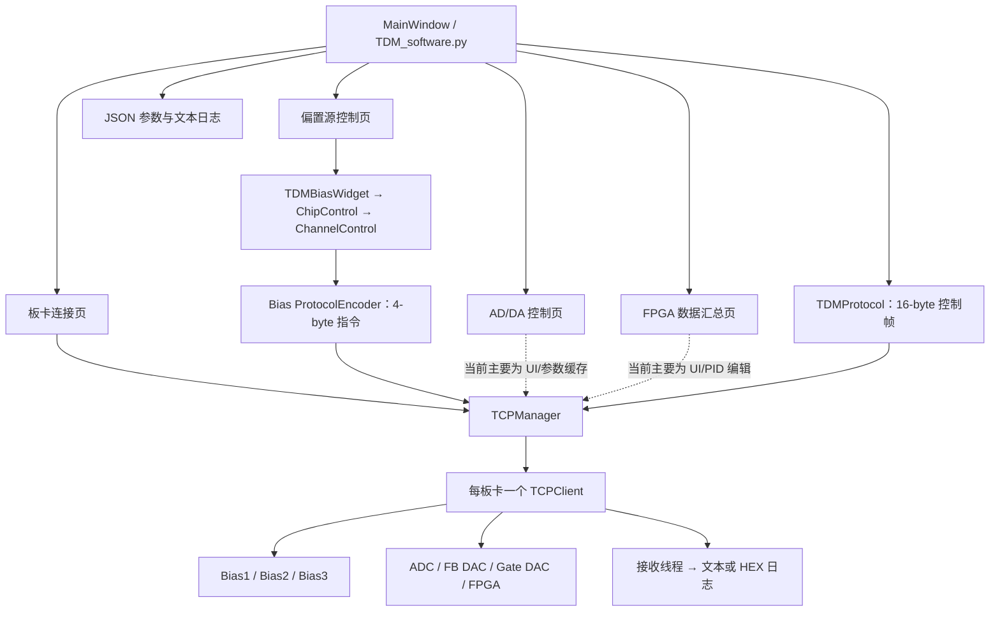

# TES–SQUID TDM 上位机软件：项目框架与当前进度

> 文档基线：2026-07-13，代码基线为 `main` 分支 `931d338`。
> 本文依据 `Main/` 当前代码、`ref/` 说明与参考实现、`test/` 测试脚本整理。完成状态表示代码仓库中已有相应实现，不等同于已经通过实机验收。

## 1. 项目定位

本项目是面向 TES 探测器 SQUID 时分复用（TDM）读出系统的桌面上位机软件。软件负责：

- 管理偏置源板、ADC、反馈 DAC、选通 DAC 和 FPGA 汇总板的网络连接；
- 配置 TES/SQUID 偏置、ADC/DAC 和 FPGA/PID 参数；
- 向不同板卡编码并发送控制指令；
- 接收板卡返回数据、记录运行日志，并最终完成探测器数据的连续存储。

当前技术栈为 Python + PyQt5，板卡通信以 TCP 为主。项目处于“主要界面和基础通信已搭建，硬件协议与数据采集闭环尚待完成”的工程原型阶段。

## 2. 仓库结构

```text
TES_software/
├── Main/                         # 上位机主程序；各版本相互独立
│   ├── TDM_V0.py ... TDM_V4.py  # 早期单文件版本
│   ├── TDM_V5/                   # TCP/协议开始模块化
│   ├── TDM_V6/                   # 集成独立的 TDM Bias 控件
│   ├── TDM_V7/                   # 当前最新版本
│   ├── 数据格式.md                # 16 字节通用控制帧草案
│   └── ai_studio_code.py         # 早期/辅助生成代码，不是当前入口
├── ref/                          # 功能说明、寄存器资料和参考代码
│   ├── AD_DA_SPI_config/         # ADC/DAC/LMK SPI 配置及 TCP 发送参考
│   ├── FPGA_JESD_config/         # FPGA、JESD204B、LMK、ADC/DAC TCL 配置
│   ├── TDM_bias_config/          # 偏置源独立 GUI、TCP 与 32-bit 协议参考
│   └── TDM_config_md_py/         # FPGA TDM 64-bit 寄存器协议及发送脚本
├── test/                         # 简单 TCP 模拟服务端（当前为手工测试）
└── TDM_software.md               # 本文档
```

当前推荐入口：

```bash
cd Main/TDM_V7
/opt/anaconda3/envs/myroot/bin/python TDM_software.py
```

仓库的 VS Code 配置指向上述 Conda 环境。系统默认 `python3` 未必安装 PyQt5，且项目暂时没有 `requirements.txt`、`pyproject.toml` 或环境锁定文件。

## 3. 版本演进

| 版本 | 结构 | 主要演进 | 定位 |
|---|---|---|---|
| V0 | 单文件 | 初始多板卡 GUI、通信管理与配置界面雏形 | 原型起点 |
| V1 | 单文件 | 重构 PyQt5 界面；增加防滚轮误触、回车确认、Esc 恢复等安全交互控件 | 交互优化 |
| V2 | 单文件 | 增加独立发送线程等通信处理 | 异步通信探索 |
| V3 | 单文件 | 引入 `struct` 和 16 字节 `TDMProtocol` 打包 | 二进制协议接入 |
| V4 | 单文件 | 增加 PID 矩阵表头高亮、单元格预选和批量编辑 | FPGA/PID 交互增强 |
| V5 | 主程序 + 模块 | 抽出 `tcp_client.py`、`tcp_manager.py`、`protocol.py`，用统一 TCP 管理器替代主窗口内的连接/发送线程 | 通信层模块化 |
| V6 | 模块化目录 | 集成 `TDM_bias_widget`、DAC/通道控件和独立 Bias 协议 | 偏置源参考界面并入主程序 |
| V7 | 模块化目录 | 增加页面参数 JSON 保存/读取、日志保存和输入控件优化 | 当前开发基线 |

V7 并非完全模块化：TCP、Bias 协议和 Bias 控件已拆分，但主窗口文件仍约 2100 行，AD/DA、FPGA、PID、配置管理和日志逻辑仍集中在 `TDM_software.py` 中。

## 4. 当前软件架构



### 4.1 表现层

V7 主界面包含 4 个主标签页：

1. **板卡连接**：统一管理 7 类板卡的 IP、端口、本地 IP、连接/断开和链路探测。
2. **偏置源控制**：3 块 Bias 板子页；每块板包含 6 个 DAC、每个 DAC 8 个通道，可设置波形、频率、归一化幅值和偏置电流。
3. **AD/DA 控制**：ADC、FB DAC 和 20 行选通 DAC 的参数界面。
4. **FPGA 数据汇总**：数据读出/反馈/选通开关、存储设置，以及 20×16 PID 参数矩阵。

全局底部区域提供系统日志、状态显示以及当前页面参数的保存/读取。

### 4.2 通信层

- `TCPManager` 以 `board_type` 为键，按需创建并管理多个 `TCPClient`。
- `TCPClient` 支持连接、断开、发送、后台接收和独立链路探测。
- Qt 信号将连接状态、接收数据和探测结果送回主线程，避免接收线程直接操作界面。
- V7 的正式连接过程仍在 GUI 线程中执行，socket 超时为 3 秒；连接不可达设备时可能短暂阻塞界面。V5/V6 曾使用后台连接线程，V7 的 `tcp_client.py` 已改回同步连接。

### 4.3 协议层

仓库目前出现三类控制格式，应按目标板卡明确归属，而不是混用：

| 协议 | 实现/说明 | 格式 | 当前用途 |
|---|---|---|---|
| 通用 TDM 控制帧 | `Main/TDM_V7/protocol.py`、`Main/数据格式.md` | 16 byte，`0xAA55` 帧头，含板号、参数号、值和 CRC16 | 主界面测试帧、旧 Bias 参数批量打包逻辑 |
| Bias DAC 指令 | `bias_protocol.py`、`ref/TDM_bias_config/` | 32 bit 大端：Header/Chip/Cmd/Data | V6/V7 当前 Bias 通道的 Set 操作 |
| FPGA SiTCPXG 寄存器命令 | `ref/TDM_config_md_py/` | 64 bit：8-bit 地址 + 56-bit 数据 | FPGA 12 个寄存器配置参考，尚未并入 V7 |

当前接收方向没有协议解码器：收到的数据仅尝试转成 UTF-8，失败后显示十六进制摘要；ACK、错误帧、读回帧、数据帧及粘包/拆包均未形成处理状态机。

### 4.4 配置与日志

V7 支持：

- Bias、AD/DA、FPGA 当前页面参数保存为 JSON；
- 从 JSON 恢复当前页面控件值；
- 将全局连接日志保存为文本。

当前配置文件没有 schema 版本、软件版本、硬件型号、生成时间和校验信息；加载时主要检查顶层 `type`，尚不具备严格字段校验和跨版本迁移能力。

## 5. 当前进度评估

### 5.1 已完成或基本可用

| 模块 | 状态 | 现有能力 |
|---|---|---|
| 主界面框架 | 已完成 | 4 个主页面、日志区、状态区可初始化 |
| 多板卡 TCP 管理 | 基本完成 | 7 类板卡独立连接、断开、群组操作、链路探测、异步接收 |
| Bias 控件 | 基本完成 | 3 板 × 6 DAC × 8 通道的参数编辑与单通道指令发送 |
| 16 字节协议打包 | 已完成编码 | 大端数值、CRC-16/CCITT-FALSE；已通过本地长度与 CRC 冒烟检查 |
| Bias 32-bit 协议打包 | 已完成编码 | 通道选择、波形、FTW、幅值和 offset 共 6 条指令 |
| PID 参数编辑 | 基本完成 UI | 20×16 单元格、全局同步、行列选择、批量编辑和颜色状态 |
| 参数/日志保存 | 部分完成 | 当前页面 JSON 保存/读取、文本日志保存 |
| Bias 模拟服务端 | 可用于手工联调 | 可解析 4-byte Bias 指令和还原频率 FTW |

### 5.2 部分完成

| 模块 | 已有内容 | 尚缺闭环 |
|---|---|---|
| AD/DA 控制 | ADC、FB DAC、Gate DAC 参数 UI | 读取/写入/保存按钮未连接槽函数，没有协议打包和实机读回 |
| FPGA 控制 | 主开关、PID 矩阵、存储参数 UI | 未接入 ref 中 64-bit 寄存器协议，开关与 PID 变化没有下发 |
| 数据接收 | TCP 后台收包、日志预览 | 无缓存拆帧、协议解析、ACK/错误处理、数据解复用和统计 |
| 数据存储 | 路径、格式、前缀、分卷间隔、开始/停止按钮 | 开始/停止按钮未连接，未实现文件写入、分卷和元数据 |
| 状态监控 | 状态标签和部分连接状态更新 | FPGA 状态、温度等没有真实遥测来源；全局通信状态未完整聚合 |
| 测试 | 模拟服务端、TCP 和 Qt 信号冒烟脚本 | 没有 pytest/unittest 断言、协议金样、GUI 测试和 CI |

### 5.3 本次核查结果

- 所有仓库内 Python 文件均通过 AST 语法解析。
- 使用仓库 VS Code 指定的 `/opt/anaconda3/envs/myroot/bin/python` 和 offscreen Qt，V7 主窗口初始化成功：4 个主标签、3 个 Bias 子标签、2 个 AD/DA 子标签、20×16 PID 表均可创建。
- AD/DA 的读取/写入/保存按钮和数据存储的开始/停止按钮均为 **0 个信号接收者**，确认尚未实现业务逻辑。
- 16-byte TDM 帧和 6×4-byte Bias 配置指令完成本地编码冒烟检查。
- 当前 `test/` 下两个模拟服务端内容完全相同；V5/V6/V7 的若干测试脚本也重复，且均属于手工脚本而非自动化测试。

## 6. 当前关键问题与风险

按风险优先级排列：

1. **硬件协议未收敛**：16-byte 通用帧、4-byte Bias 帧和 8-byte FPGA 寄存器命令并存，但缺少一份按板卡、固件版本定义的权威协议矩阵。
2. **板卡命名存在冲突**：`Main/数据格式.md` 和旧 `BiasBoardWidget` 将 Bias2 定义为 SA、Bias3 定义为 IS；V7 连接页和 Bias 子页则标为 Bias2=IS、Bias3=SA。实机下发前必须统一。
3. **Bias 波形枚举不一致**：V7 控件索引为 Sine=0、Square=1、Triangle=2、DC=3，而 `mock_bias_server.py` 按 DC=0、Triangle=1、Square=2、Sine=3 解析。需要以固件定义为准并增加金样测试。
4. **FPGA 配置维度错误**：界面 PID 表是 20×16，但 `get_fpga_config()`/`set_fpga_config()` 按 32×8 遍历，导致只保存前 8 列并丢失后 8 列。
5. **控制链路未闭环**：AD/DA 按钮、FPGA 开关、PID 下发和数据存储仍是 UI 占位；当前无法完成“配置—确认—采集—落盘”的完整实验流程。
6. **TCP 流处理不足**：未处理 TCP 粘包/拆包、半帧缓存、CRC 校验、ACK 超时、重试和命令关联；收到的二进制数据只显示 HEX。
7. **连接可能阻塞 GUI**：V7 正式 `connect()` 在 GUI 调用链上同步执行，单块不可达板卡可阻塞约 3 秒，一键连接 7 块板时影响更明显。
8. **配置可追溯性不足**：JSON 无 schema/version；Bias 保存使用构造时的 `default_ip` 而不是当前输入框 IP；加载缺少数值范围和硬件兼容性校验。
9. **工程化基础缺失**：无依赖清单、统一启动脚本、自动化测试、CI、日志轮转和发布打包流程；V7 目录还包含 zip、`.DS_Store` 等非源码产物。
10. **主程序耦合偏高**：V7 主文件承担界面、状态、配置、协议调用和业务编排，且仍保留未使用的旧 `BiasBoardWidget` 等遗留逻辑，后续功能扩展和测试成本较高。
